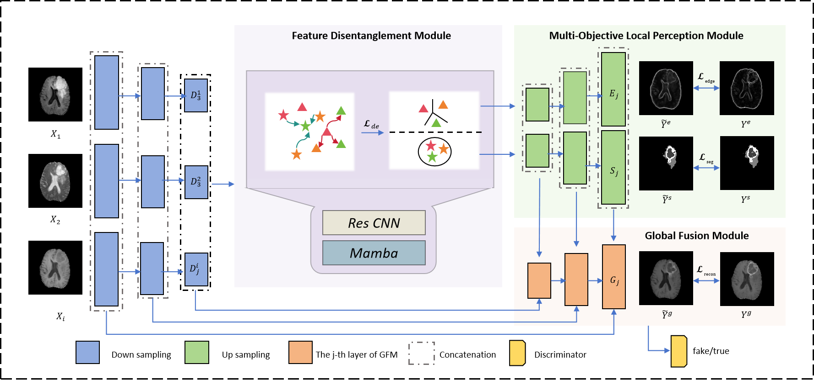

# Disentangle and Then Fuse: A Cross-Modal Network for Synthesizing Gadolinium-Enhanced Brain MR Images

The PyTorch implements of **Disentangle and Then Fuse: A Cross-Modal Network for Synthesizing Gadolinium-Enhanced Brain MR Images**.

**The overview of our DTF-Net framework.**



Our method can synthesize clear and natural images, especially local lesion regions, and outperforms other state-of-the-art methods on many datasets.

Experimental results on **(a)BraTS2020 (b)BraTS2021 (c)private HPPH** dataset.


## Datasets
Download the datasets from the official way and rearrange the files to the following structure.
The dataset path can be modified in the DTF-Net/options/\*.yaml file.
### BraTS2020
```
MICCAI_BraTS2020_TrainingData
├── flair
│   ├── BraTS20_Training_001_flair.nii.gz
│   ├── BraTS20_Training_002_flair.nii.gz
│   ├── BraTS20_Training_003_flair.nii.gz
│   ├── ...
├── t2
│   ├── BraTS20_Training_001_t2.nii.gz
│   ├── BraTS20_Training_002_t2.nii.gz
│   ├── BraTS20_Training_003_t2.nii.gz
│   ├── ...
├── t1
│   ├── BraTS20_Training_001_t1.nii.gz
│   ├── BraTS20_Training_002_t1.nii.gz
│   ├── BraTS20_Training_003_t1.nii.gz
│   ├── ...
├── t1ce
│   ├── BraTS20_Training_001_t1ce.nii.gz
│   ├── BraTS20_Training_002_t1ce.nii.gz
│   ├── BraTS20_Training_003_t1ce.nii.gz
│   ├── ...
```


## Citation
If you find this code useful in your research, please consider citing:
```
@article{che2025disentangle,
  title={Disentangle and Then Fuse: A Cross-Modal Network for Synthesizing Gadolinium-Enhanced Brain MR Images},
  author={Che, Zengyang and Zhang, Zheng and Wu, Yaping and Wang, Meiyun},
  journal={IEEE Transactions on Circuits and Systems for Video Technology},
  year={2025},
  publisher={IEEE}
}
```
